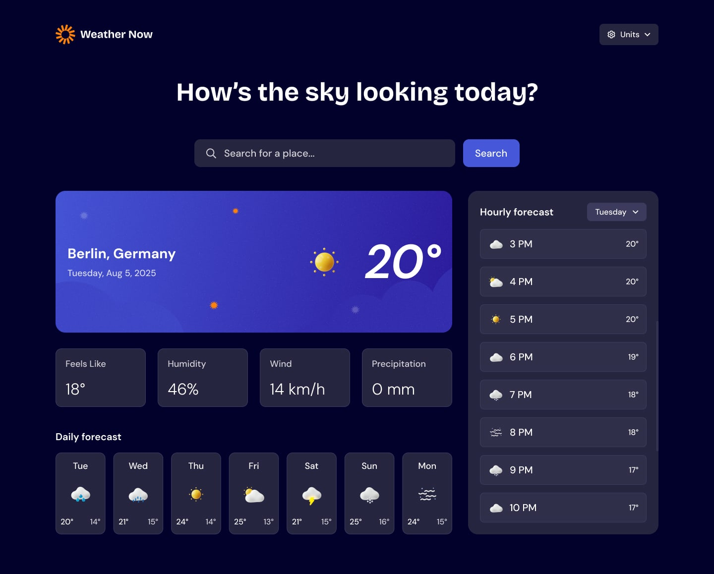

# 🌤️ Weather Now

A clean, fast weather app built with React + TypeScript.

## Demo



<!-- Live link: e.g. https://weather-now.your-domain.com -->

## Overview

Open it up and it already knows where you are — current conditions, a 7-day outlook, and hour-by-hour detail, all in one view. Search any city, switch between Metric and Imperial, and get on with your day.

This started as a Figma-to-code exercise (converting a design screen by screen into React + Tailwind components) and grew into a full app: real geolocation, a live weather API, city search, and unit conversion, all wired up on top of the static UI.

## Features

- **Auto-detect location** — On first load, automatically shows current weather based on the user's location
- **Location search** — Search for weather by city or location name
- **Current conditions** — View temperature, weather icon, and location details at a glance
- **Detailed metrics** — See "feels like" temperature, humidity, wind speed, and precipitation
- **7-day forecast** — Browse daily highs/lows with weather icons for the week ahead
- **Hourly forecast** — Track temperature changes throughout the day, with a day selector to jump between different days
- **Unit conversion** — Toggle between Imperial and Metric systems, or fine-tune individual units:
  - Temperature: °C / °F
  - Wind speed: km/h / mph
  - Precipitation: mm

## Tech Stack

- [React 19](https://react.dev/) + [TypeScript](https://www.typescriptlang.org/)
- [Vite](https://vite.dev/) (Rolldown-powered) with the [React Compiler](https://react.dev/learn/react-compiler) enabled
- [Tailwind CSS v4](https://tailwindcss.com/)
- [Axios](https://axios-http.com/) for data fetching
- [Open-Meteo](https://open-meteo.com/) — forecast and city-search (geocoding) APIs
- [BigDataCloud](https://www.bigdatacloud.com/) — reverse geocoding (turns coordinates into a city/country name)

## Getting Started

Requires [Node.js](https://nodejs.org/).

```bash
git clone <this-repo-url>
cd weather-app
npm install
npm run dev
```

The app runs at `http://localhost:5173` by default.

### Environment Variables

None needed — both Open-Meteo and BigDataCloud are called directly from the client with no API key.

## Usage

1. On first load, the browser will ask for location permission. Allow it to see current weather for where you are.
2. No location, or want somewhere else? Use the search bar to look up any city by name and pick it from the results.
3. Scroll the daily forecast for the week ahead, and use the day dropdown in the hourly panel to jump between days.
4. Open the Units dropdown in the header to switch the whole app between Metric/Imperial, or fine-tune temperature/wind/precipitation independently.

## Available Scripts

| Command           | Description                                    |
| ----------------- | ---------------------------------------------- |
| `npm run dev`     | Start the Vite dev server                      |
| `npm run build`   | Type-check (`tsc -b`) and build for production |
| `npm run lint`    | Run ESLint over the project                    |
| `npm run preview` | Preview the production build locally           |

## Project Structure

```
src/
├── pages/WeatherApp.tsx        # The page, composes all sections
├── components/
│   ├── sections/                # One component per screen section
│   ├── skeletons/                # Loading-state counterparts of sections
│   └── Icons.tsx                 # Central inline-SVG icon index
├── hooks/                       # Shared custom hooks (e.g. dropdown behavior)
├── utils/                       # Shared types and helpers (fetching, formatting)
├── assets/                      # Fonts and Figma-sourced images/icons
└── App.tsx                      # App-wide state: units, geolocation, weather data
```

For a deeper look at how the pieces fit together (state flow, data fetching, context shape), see [`CLAUDE.md`](./CLAUDE.md).

## What I Learned / Challenges

- **Bucketing hourly data by day** — Open-Meteo returns a flat 168-entry array (7 days × 24 hours). Grouping it into per-day buckets and sampling every 3rd hour was originally a slice-then-filter per day; simplifying it to one pass over the flat array (`Math.floor(i / 24)` to find the bucket) removed a lot of redundant intermediate arrays.
- **Two-source location lookups** — combining Open-Meteo (forecast) with BigDataCloud (reverse geocoding for the city/country label) meant firing both requests in parallel with `Promise.all` rather than chaining them.
- **A JavaScript date-parsing gotcha** — Open-Meteo's daily forecast returns date-only strings (`"2026-07-14"`), which JS parses as UTC midnight, while hourly data returns full datetime strings with no offset, which JS parses as local time. Formatting both the same way caused the daily forecast's weekday label to be off by a day in timezones behind UTC — fixed by explicitly pinning the daily formatter to `timeZone: "UTC"` so it matches how it was parsed.
- **One error flag, two failure modes** — geolocation failures and weather-fetch failures both fed into a single `isError` boolean. That turned out to have real UX consequences (an ambiguous "Retry" that always re-runs geolocation, even when the actual failure was the fetch), which is why it's called out as a known limitation below rather than something silently swept under the rug.

## Roadmap / Future Improvements

- Split the shared `isError` flag into a discriminated error state (geolocation vs. fetch failure) so "Retry" can re-run only the step that actually failed, and so the search UI stays reachable during a geolocation-only error
- Cancel in-flight weather requests (`AbortController`) so rapid unit toggles or successive city searches can't let a stale response overwrite a newer one
- Persist the last-known location to `localStorage` so a page refresh skips the geolocation prompt entirely
- Skip the redundant reverse-geocode call when only units change and the location hasn't moved
- Extract the repeated weather-icon `src`/`alt` construction (currently duplicated across `WeatherInfo`, `DailyForecast`, `HourlyForecast`) into one shared helper

## License

MIT — see [LICENSE](./LICENSE).
